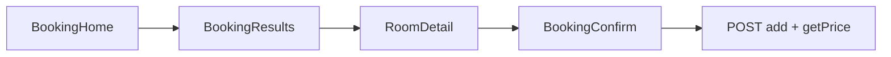

# Android — Novedades (Proyecto Individual)

Extensión de la app intermodular (Kotlin + Compose + Retrofit). Login, registro, perfil, reservas clásicas y reseñas están en la memoria del módulo; **este README solo documenta lo añadido después**.

API: [README API](../API-Intermodular-Ysael/README.md)

---

## Resumen vs memoria intermodular

| Antes (memoria) | Añadido en app individual |
|-----------------|---------------------------|
| Home con contacto + lista reservas | Flujo **Booking** (búsqueda → resultados → detalle → confirmar) |
| `Room` simple, `RoomRepository` básico | Galería, ofertas, extras, filtros por servicio |
| Sin PDF | Justificante + factura fiscal |
| Sin fidelidad | **P9** Estadísticas + Mis estancias |
| Sin flex horaria | **P19** check-in anticipado / salida tardía + fin de estancia |
| Paquetes planos | **core / data / feature / ui** |

---

## Arquitectura (paquetes nuevos)

```
core/          navigation, network, session, util (MediaUrls, InvoicePdfHelper)
data/          model, repository
feature/       booking, flexibility, loyalty, invoice, reservation (ampliado)
ui/            theme Material 3, Scaffold, Components
```

Legacy eliminado: `ui/Views/Home.kt`, formulario `Add` antiguo.

---

## Configuración

`app/build.gradle.kts` → `BuildConfig.API_BASE_URL`  
Override opcional en `local.properties`:

```properties
hotel.api.base.url=http://10.0.2.2:3011/
```

---

## Flujo Booking (sustituye reserva por diálogo)



- `BookingSearchSession`: fechas, huéspedes, rango precio compartidos
- `GET /room/available` con fechas ISO y filtro chips **servicios extra**
- `Room.displayPricePerNight()`, `galleryImageUrls()` — oferta y galería API
- Bottom bar: **Inicio** · **Reservas** · **Estadísticas**

---

## P9 · Fidelidad y estancias

| Pantalla | Ruta | API |
|----------|------|-----|
| Estadísticas | `ClientStats` | `GET /loyalty/me` |
| Mis estancias | `MyStays` | `GET /users/{id}/history` |
| Detalle | `StayDetail/{id}` | Ítem de historial |

`P9InsightsCard`: temporada favorita, habitación top, racha.

---

## P19 · Flexibilidad (cliente)

| UI | API |
|----|-----|
| Check-in anticipado | `PATCH /bookings/{id}/request-early-checkin` |
| Check-out tardío (hoy) | `PATCH /bookings/{id}/request-late-checkout` |
| Preview tarifa | `GET /bookings/{id}/flexibility` |
| Instalaciones (fin estancia) | `late_mode: facilities` |

- **Ventana 12 h** tras 11:00 del día de salida (`FlexibilityRepository`)
- `EndOfStayDecisionDialog`: ampliar vs instalaciones
- Notificaciones locales: `FlexibilityPollWorker`, `FlexibilityNotificationHelper`
- Chips estado en tarjetas Mis reservas

Plata/oro: auto-aprobación; bronce: pendiente en WPF.

---

## Ampliación de estancia

- `ExtendStayDateDialog` → `PATCH /bookings/{id}/extend-stay`
- Lista activa: sin `cancelation_date` ni `superseded_by_reservation_id`
- Tras éxito: refresco `GET /reservation/mine`

---

## PDF y facturas

| Documento | Endpoint | UI |
|-----------|----------|-----|
| Justificante | `GET …/booking-receipt` | Mis reservas, historial, ModReserva, facturas pendientes |
| Factura fiscal | `GET …/invoice` | Solo si `invoice_number` |
| Listado | `GET /invoices?userId=` | `InvoiceHistoryScreen` + `confirm-payment` auto |

`InvoicePdfHelper` + `FileProvider`.

---

## Otras pantallas nuevas

| Pantalla | Función |
|----------|---------|
| `ReservationAudit` | Historial amigable (`BookingHistoryFriendlyMapper`) |
| `ReservationHistory` | Todas las reservas (incl. canceladas) |
| `InvoiceHistory` | `HotelInvoice` multi-tipo |
| `RoomDetail` | Carrusel `HorizontalPager` + indicadores |

---

## Modelo `Room` (campos nuevos)

`images`, `extraServices`, `offerActive`, `offerPercent`, `effectivePricePerNight`, `is_operational`, `is_occupied_now` — ver `data/model/Room.kt`.

---

## Archivos clave (novedades)

```
feature/booking/       BookingHomeScreen, BookingResultsScreen, BookingConfirmScreen
feature/flexibility/   FlexibilityUi, FlexibilityRepository, workers
feature/loyalty/       ClientStatsScreen, MyStaysScreen, P9InsightsCard
feature/invoice/       InvoiceHistoryScreen
feature/reservation/   ReservationAuditScreen, MyBookingsScreens (ampliado)
core/util/             InvoicePdfHelper, MediaUrls
data/repository/       FlexibilityRepository, RoomRepository (available + extras)
```

---

## Navegación (rutas nuevas principales)

`Routes.kt`: `BookingHome`, `BookingResults`, `BookingConfirm`, `ClientStats`, `MyStays`, `InvoiceHistory`, `ReservationHistory`, `ReservationAudit`, …

Destino inicial autenticado: **`booking/home`** (no Home legacy).
