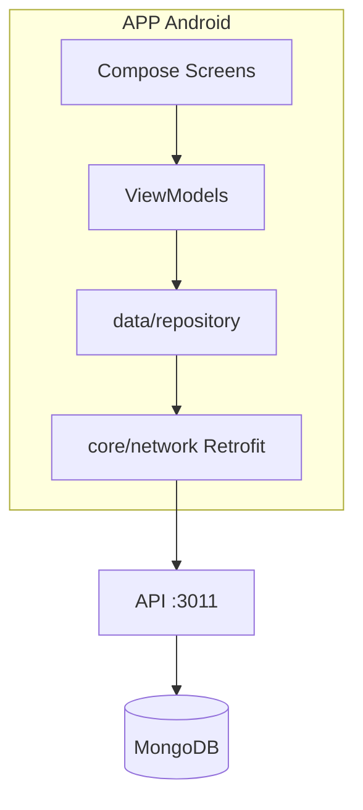
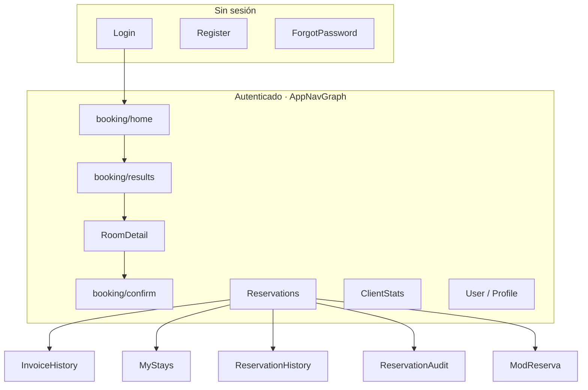
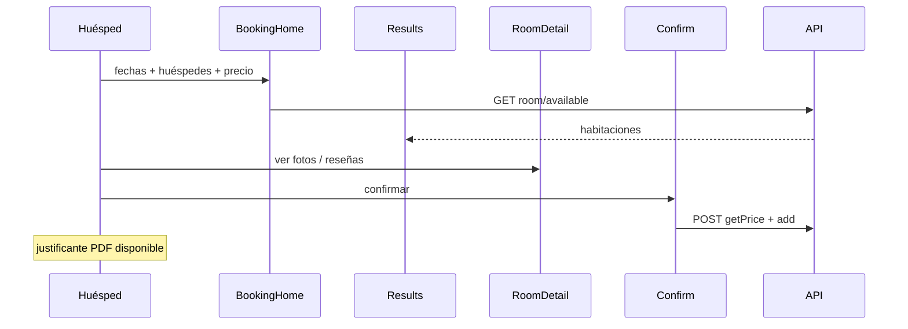
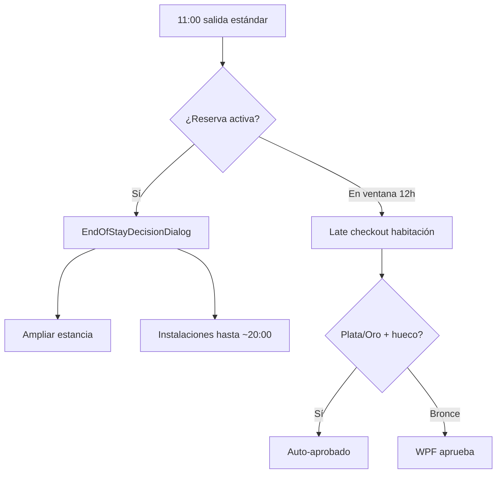
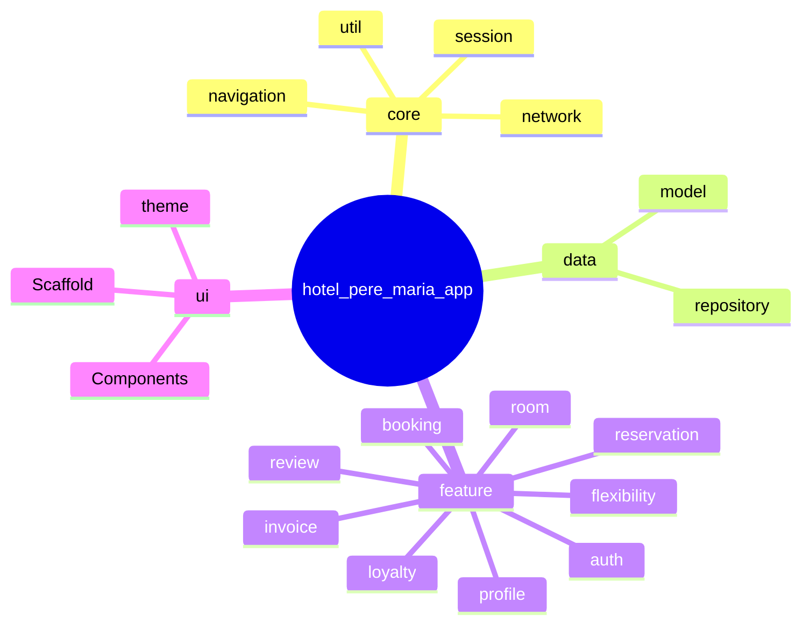

# APP Android — Hotel Pere María

Cliente móvil para huéspedes del **Hotel Pere María**, desarrollado con **Kotlin** y **Jetpack Compose**. Se conecta a la API REST (**Retrofit** + **Gson**); datos en **MongoDB** solo en servidor. Incluye búsqueda tipo Booking, **P9** estadísticas, **P19** flexibilidad, **fin de estancia** (ampliar / instalaciones), ampliación de estancia, facturas PDF y perfil con foto.

API y base de datos: [README API](../API-Intermodular-Ysael/README.md).

---

## Tabla de contenidos

- [Arquitectura del sistema](#arquitectura-del-sistema)
- [Diagramas y flujos visuales](#diagramas-y-flujos-visuales)
- [Requisitos y configuración](#requisitos-y-configuración)
- [Identidad visual (UX)](#identidad-visual-ux)
- [Tecnologías](#tecnologías)
- [Estructura del código](#estructura-del-código)
- [Patrón en capas (detalle)](#patrón-en-capas-detalle)
- [Base de datos MongoDB (vía API)](#base-de-datos-mongodb-vía-api)
- [Navegación](#navegación)
- [Conexión con la API](#conexión-con-la-api)
- [Ejemplos de código](#ejemplos-de-código)
- [Flujos principales](#flujos-principales)
- [Evolución del proyecto](#evolución-del-proyecto-desde-la-creación)
- [P9 · Mis estadísticas (cliente)](#p9--mis-estadísticas-cliente)
- [P9 · Mis estancias (historial)](#p9--mis-estancias-historial)
- [P19 · Flexibilidad (cliente)](#p19--flexibilidad-cliente)
- [Ampliación de estancia (cliente)](#ampliación-de-estancia-cliente)
- [Facturas (HotelInvoice)](#facturas-hotelinvoice)

---

## Requisitos y configuración

| Requisito | Detalle |
|-----------|---------|
| IDE | Android Studio (Hedgehog o superior) |
| SDK mínimo | API 24 (Android 7.0) |
| Red | Misma red que el PC que ejecuta la API, o emulador con `10.0.2.2` |

La URL base se define en `app/build.gradle.kts` como `BuildConfig.API_BASE_URL`. También se puede sobrescribir en `local.properties`:

```properties
hotel.api.base.url=http://192.168.x.x:3011/
```

| Entorno | URL típica |
|---------|------------|
| Emulador | `http://10.0.2.2:3011/` (alias al host) |
| Dispositivo físico | `http://<IP_del_PC>:3011/` |

Tras cambiar la URL, **recompilar** la app para regenerar `BuildConfig`.

---

## Arquitectura del sistema



---

## Diagramas y flujos visuales

### Mapa de navegación



### Embudo de reserva (tipo Booking)



### Fin de estancia y P19 (día de salida)



### Jerarquía de paquetes (código)



### Ejemplo de tarjeta «Mis reservas»

```
┌─────────────────────────────────────┐
│  RSV-00042 · HAB-101                │
│  Entrada 18/05 · Salida 21/05       │
│  [Check-in anticipado] [Salida hoy] │
│  Estado: ● Aprobada  14:00          │
│  [Justificante] [Factura] [Actividad]│
└─────────────────────────────────────┘
         │
         ▼ (tras 11:00, ventana 12 h)
┌─────────────────────────────────────┐
│  ¿Qué quieres hacer?                │
│  [ Ampliar estancia ]               │
│  [ Seguir en instalaciones ]      │
└─────────────────────────────────────┘
```

---

## Identidad visual (UX)

La interfaz actual sigue una línea **moderna, limpia y orientada a reservas**, alineada con lo que los usuarios esperan de apps de viaje:

| Principio | Cómo se aplica |
|-----------|----------------|
| **Fondo y superficies** | Predominio de **blanco** y grises muy suaves (`surface`, `surfaceVariant`) para legibilidad y sensación de amplitud. |
| **Acento** | **Azul pastel** del tema Material 3 (`primary`, `primaryContainer`) para botones, enlaces, chips activos y barra superior; evita el exceso de color en pantallas densas. |
| **Jerarquía** | Títulos claros, tarjetas con sombra ligera y mucho espacio en blanco entre bloques (motor de búsqueda, próxima reserva, resultados). |
| **Navegación** | Barra inferior: Inicio · Reservas · Estadísticas. **TopAppBar:** logo del hotel (`R.drawable.hotel_logo`) y **foto de perfil** del usuario (Coil + URL vía `MediaUrls`). |
| **Detalle de habitación** | **Carrusel horizontal** de fotos con indicadores y texto guía; precio destacado con soporte para **ofertas** si la API las envía. |

El archivo `ui/theme/` define la paleta (`Color.kt`, `Theme.kt`). El objetivo es **profesional y calmado**, no recargado.

---

## Tecnologías

| Tecnología | Uso |
|------------|-----|
| Kotlin | Lenguaje |
| Jetpack Compose + Material 3 | UI declarativa y componentes |
| Navigation Compose | Grafo de navegación dentro del scaffold |
| Retrofit + Gson | HTTP y JSON |
| OkHttp | JWT en interceptor + logging opcional |
| Coroutines + Flow | Async y estado (`StateFlow` en repositorios) |
| Coil | Imágenes en listas y carrusel |

---

## Estructura del código

Ruta base: `app/src/main/java/com/example/hotel_pere_maria_app/`

```
com/example/hotel_pere_maria_app/
├── HotelApplication.kt
├── MainActivity.kt
├── core/
│   ├── navigation/          # Routes, AppNavHost, AppNavGraph
│   ├── network/             # RetrofitClient + *Service (API)
│   ├── session/             # SessionManager, ThemeManager
│   └── util/                # MediaUrls, ApiMessages, InvoicePdfHelper
├── data/
│   ├── model/               # DTOs (Reservation, Room, Flexibility…)
│   └── repository/          # RoomRepository, ReservationRepository, …
├── feature/
│   ├── auth/                # Login, registro, recuperar contraseña
│   ├── booking/             # Búsqueda tipo Booking + BookingHomeViewModel
│   ├── reservation/         # Mis reservas, modificar, auditoría amigable
│   ├── flexibility/         # P19 UI, workers, notificaciones
│   ├── loyalty/             # Estadísticas + Mis estancias
│   ├── invoice/             # Mis facturas
│   ├── profile/             # Perfil y foto
│   ├── review/              # Mis reseñas
│   └── room/                # Detalle habitación
└── ui/
    ├── theme/               # Material 3
    ├── Scaffold/            # TopAppBar, bottom bar, shell
    └── Components/          # FechaInputSimple (DateInputs.kt)
```

Código legacy (`ui/Views/Home.kt`, paquete plano `ui/Models`) eliminado. Reorganización: `scripts/reorganize-packages.ps1`.

---

## Patrón en capas (detalle)

Diagramas: [Arquitectura del sistema](#arquitectura-del-sistema) · [Navegación y embudo](#diagramas-y-flujos-visuales).

```
Pantalla (Compose) → ViewModel (opcional) → Repository / Service (Retrofit) → API
```

Los repositorios (`RoomRepository`, etc.) centralizan red y exponen `StateFlow` para que las pantallas reaccionen sin bloquear el hilo principal.

---

## Base de datos MongoDB (vía API)

La app **no accede** a MongoDB directamente. Todos los datos pasan por la API. Documentación completa de colecciones y relaciones: [README API — Base de datos](../API-Intermodular-Ysael/README.md#base-de-datos-mongodb-colecciones-y-relaciones).

### Qué pantalla usa qué colección (indirectamente)

| Pantalla Android | Colección(es) en Mongo | Uso principal |
|------------------|-------------------------|---------------|
| Login / registro / perfil | `users` | Cuenta, DNI, foto de perfil |
| Búsqueda y detalle habitación | `rooms`, `extraservices` | Disponibilidad, precio, fotos, extras |
| Mis reservas / confirmar | `reservations` | RSV activas, P19 embebido, ampliaciones |
| Estadísticas (P9) | `clientloyaltystats`, `reservations` | Rango fidelidad, noches, gasto |
| Mis estancias | `reservations`, `reviews` | Historial completado |
| Mis facturas | `hotelinvoices` | PDF por tipo (estancia, P19, ampliación) |
| Valoraciones | `reviews` | Opiniones tras estancia |

### Relaciones útiles para el huésped

- Tu usuario (`CLI-xxxxx`) tiene **muchas reservas** (`RSV-xxxxx`); cada reserva apunta a **una habitación** (`HAB-xxx`).
- Las **solicitudes P19** (entrada anticipada / salida tardía) viven **dentro** del documento de reserva, no en una colección aparte.
- Las **facturas** emitidas se guardan en **`hotelinvoices`** (puede haber más de una por la misma reserva).
- Tu **rango de fidelidad** (bronce/plata/oro) está en **`clientloyaltystats`** (un documento por cliente); la API lo usa para auto-aprobar P19.

---

## Navegación

Mapa visual en [Diagramas y flujos visuales](#diagramas-y-flujos-visuales) (grafo `AppNavGraph` + embudo reserva).

- **`NavegationMain`**: login / registro / scaffold autenticado.
- **Destino inicial del área cliente**: `booking/home`.
- **Rutas relevantes** (`Routes.kt`): `BookingHome`, `BookingResults`, `BookingConfirm`, `RoomDetail`, `Reservations`, `ClientStats`, `MyStays`, `StayDetail`, `InvoiceHistory`, `ReservationHistory`, `ReservationAudit`, `Reviews`, `User`, `ModReserva`, …

**Barra inferior** (`BottomBookingBar.kt`): **Inicio** (búsqueda) · **Reservas** (Mis reservas) · **Estadísticas** (P9 fidelidad).

En **Mis reservas**, chips superiores: **Facturas** · **Estancias** · **Todas** (historial completo).

El **scaffold** (barra superior) se oculta en pantallas a pantalla completa (`ModReserva`, auditoría, historial de reservas/facturas).

---

## Conexión con la API

`RetrofitClient` centraliza la base URL (`BuildConfig.API_BASE_URL`) y añade el token en cada petición autenticada:

```kotlin
private val authInterceptor = Interceptor { chain ->
    val request = chain.request().newBuilder()
    SessionManager.userToken?.let {
        request.addHeader("Authorization", "Bearer $it")
    }
    chain.proceed(request.build())
}
```

### Habitaciones (`RoomService.kt`)

Parámetros **camelCase** (`checkIn`, `checkOut`, `guests`) como espera la API. El repositorio normaliza fechas a **ISO** antes de llamar (tanto si el usuario escribió `dd/MM/yyyy` como si ya viene `yyyy-MM-dd`):

```kotlin
private fun toISO(date: String): String {
    val t = date.trim()
    if (t.matches(Regex("\\d{4}-\\d{2}-\\d{2}"))) return t
    return try {
        val inp = SimpleDateFormat("dd/MM/yyyy", Locale.getDefault())
        val out = SimpleDateFormat("yyyy-MM-dd", Locale.getDefault())
        val parsed: Date? = inp.parse(t)
        if (parsed != null) out.format(parsed) else t
    } catch (e: Exception) {
        t
    }
}
```

```kotlin
@GET("room/available")
suspend fun getAvailableRoomsByDates(
    @Query("checkIn") checkIn: String,
    @Query("checkOut") checkOut: String,
    @Query("guests") guests: Int? = null,
): Response<List<Room>>

@GET("room/extra-services")
suspend fun listExtraServices(): Response<List<ExtraService>>
```

Si `room/available` devuelve error HTTP, el repositorio guarda el cuerpo en `availableError` para mostrarlo en la UI (no solo un fallo silencioso).

### Reservas y PDF (`ReservationService.kt`)

```kotlin
@GET("reservation/{reservation_id}/booking-receipt")
@Streaming
suspend fun downloadBookingReceiptPdf(@Path("reservation_id") reservationId: String): Response<ResponseBody>

@GET("reservation/{reservation_id}/invoice")
@Streaming
suspend fun downloadInvoicePdf(@Path("reservation_id") reservationId: String): Response<ResponseBody>
```

El justificante **no** exige `invoice_number`; la factura fiscal **sí** (tras checkout en recepción vía WPF).

---

## Ejemplos de código

### Rutas de navegación (`Routes.kt`)

El grafo actual gira en torno al flujo **booking** y pantallas de cuenta / reservas:

```kotlin
sealed class Routes(val route: String) {
    object BookingHome : Routes("booking/home")
    object BookingResults : Routes("booking/results")
    object BookingConfirm : Routes("booking/confirm/{roomId}") {
        fun createRoute(roomId: String) = "booking/confirm/$roomId"
    }
    object Reservations : Routes("Reservations")
    object InvoiceHistory : Routes("InvoiceHistory")
    object ReservationHistory : Routes("ReservationHistory")
    object ReservationAudit : Routes("ReservationAudit/{reservationId}") {
        fun createRoute(reservationId: String) = "ReservationAudit/$reservationId"
    }
    object RoomDetail : Routes("RoomDetail/{roomId}") {
        fun createRoute(roomId: String) = "RoomDetail/$roomId"
    }
    // … Login, Register, Reviews, User, ModReserva, …
}
```

### Sesión de búsqueda (`BookingSearchSession.kt`)

Estado en memoria (no persistido) compartido entre **inicio**, **resultados** y **confirmación**: fechas en millis, huéspedes, rango de precio y helpers `checkInIso()` / `checkOutIso()` para la API.

```kotlin
object BookingSearchSession {
    var checkInMillis: Long? by mutableStateOf(null)
    var checkOutMillis: Long? by mutableStateOf(null)
    var guests: Int by mutableIntStateOf(2)
    var priceMin: Double by mutableDoubleStateOf(20.0)
    var priceMax: Double by mutableDoubleStateOf(250.0)

    private val isoFmt = SimpleDateFormat("yyyy-MM-dd", Locale.getDefault())

    fun checkInIso(): String? = checkInMillis?.let { isoFmt.format(Date(it)) }
    fun checkOutIso(): String? = checkOutMillis?.let { isoFmt.format(Date(it)) }

    fun isComplete(): Boolean {
        val ci = checkInMillis ?: return false
        val co = checkOutMillis ?: return false
        return co > ci
    }
}
```

### Modelo `Room` — precio mostrado y galería (`Room.kt`)

La API puede enviar `effective_price_per_night` y listas `images` / `extra_services`. El cliente unifica lo que ve el usuario:

```kotlin
data class Room(
    val room_id: String,
    val image: String,
    val price_per_night: Double,
    @SerializedName("images") val images: List<String> = emptyList(),
    @SerializedName("extra_services") val extraServices: List<String> = emptyList(),
    @SerializedName("offer_active") val offerActive: Boolean = false,
    @SerializedName("offer_percent") val offerPercent: Double = 0.0,
    @SerializedName("effective_price_per_night") val effectivePricePerNight: Double? = null,
    // … is_operational, is_occupied_now, …
) {
    fun displayPricePerNight(): Double = effectivePricePerNight ?: price_per_night

    fun galleryImageUrls(): List<String> {
        val fromList = images.map { it.trim() }.filter { it.isNotEmpty() }
        if (fromList.isNotEmpty()) return fromList
        return image.split(',').map { it.trim() }.filter { it.isNotEmpty() }
    }
}
```

### Carrusel en detalle (`RoomDetail.kt`)

`HorizontalPager` + indicadores circulares + texto de ayuda; las URLs salen de `galleryImageUrls()`:

```kotlin
val urls = room.galleryImageUrls().filter { it.isNotBlank() }
val pagerState = rememberPagerState(pageCount = { urls.size })
HorizontalPager(
    state = pagerState,
    modifier = Modifier.fillMaxWidth().height(280.dp),
    beyondViewportPageCount = 1,
) { page ->
    AsyncImage(
        model = urls[page],
        contentDescription = "Imagen ${page + 1} de ${urls.size}",
        modifier = Modifier.fillMaxWidth().fillMaxHeight(),
        contentScale = ContentScale.Crop,
    )
}
```

---

## Flujos principales

Diagramas detallados en [Diagramas y flujos visuales](#diagramas-y-flujos-visuales).

1. **Inicio** (`BookingHomeScreen`): el usuario elige fechas, ajusta personas y rango de precio; opcionalmente ve su **próxima reserva**.
2. **Resultados** (`BookingResultsScreen`): lista desde `GET /room/available`; orden por valoración; filtro de precio usando `displayPricePerNight()`; chips de **servicios extra** según catálogo (todos los seleccionados deben estar en la habitación).
3. **Detalle** (`RoomDetail`): carrusel de imágenes, descripción, reseñas y botón de reserva si hay sesión de búsqueda válida.
4. **Confirmación** (`BookingConfirmScreen`): precio vía `POST /reservation/getPrice` y alta con `POST /reservation/add` (pago simulado).
5. **Mis reservas / historial**: modificar, cancelar, ver **Actividad**; descargar **justificante PDF** en cualquier momento; **factura fiscal** solo tras checkout.
6. **Mis facturas**: listado de facturas emitidas + reservas pendientes de factura fiscal con justificante descargable.
7. **Perfil** (`Profile`): datos de usuario + **Soporte** (mapa, teléfono, correo) centralizado aquí en lugar del antiguo home.

---

## Evolución del proyecto (desde la creación)

Orden aproximado de **novedades** que se fueron incorporando; cada bloque explica el *porqué* y enlaza con el código de arriba cuando aplica.

### 1. Base de la app cliente

- **Login / registro / recuperación** contra la API; **sesión JWT** persistida (`SessionManager` + `SharedPreferences`) para no pedir credenciales en cada arranque.
- **Retrofit** por módulos (`AuthService`, `ReservationService`, `RoomService`, `ReviewService`) y patrón **MVVM** con pantallas Compose.

### 2. Reservas y reseñas en el móvil

- Listado y gestión de **mis reservas**; creación y modificación alineadas con los endpoints de la API.
- **Reseñas** por habitación y listado “mis reseñas” desde perfil.

### 3. Habitaciones fuera de servicio y datos enriquecidos

- La API empezó a enviar `is_operational` / `is_occupied_now`; el **repositorio** filtra habitaciones no operativas para no ofrecerlas al huésped.
- Más tarde llegaron **galería**, **ofertas** y **servicios extra** en el JSON: el modelo `Room` con `SerializedName` y funciones `displayPricePerNight()` / `galleryImageUrls()` concentran la lógica de presentación.

### 4. Flujo tipo Booking (búsqueda → resultados → confirmar)

- Sustituye el flujo antiguo de “elegir habitación en diálogo / formulario aislado” por un **túnel claro**: `BookingHomeScreen` → `BookingResultsScreen` → `RoomDetail` → `BookingConfirmScreen`.
- **`BookingSearchSession`**: fechas, huéspedes y rango de precio compartidos entre pantallas sin serializar todo en la ruta de navegación.
- **`BookingResultsScreen`**: consume `GET /room/available` con fechas ISO; ordenación por valoración; filtro de precio sobre `displayPricePerNight()`; **chips de servicios extra** alimentados por `GET /room/extra-services` (la habitación debe cumplir todos los IDs seleccionados).

### 5. Carrusel de fotos y precio con oferta en detalle

- **`RoomDetail`**: `HorizontalPager` + **indicadores** + texto “desliza…”; imágenes desde `galleryImageUrls()` (soporta tanto `images[]` como `image` con comas legacy).
- Bloque de precio que muestra **tachado** el precio base y el **efectivo** cuando `offerActive` y `offer_percent` > 0.

### 6. Historial de reservas y auditoría “humana”

- **Reservas activas** y acceso a **historial completo** (incluye canceladas y pasadas).
- Pantalla **`ReservationAudit`**: lista de eventos de `GET /reservation/{id}/audit` con textos amigables vía `BookingHistoryFriendlyMapper` (mapea `CREATED`, `UPDATED`, `CANCELED`, y deja preparadas etiquetas para futuras acciones del backend).

### 7. Estética y navegación tipo app de viajes

- **Material 3** con fondo claro y acento azul pastel (`ui/theme/`).
- **Bottom bar** de tres pestañas: Inicio, Reservas, Estadísticas; perfil desde icono superior.
- **Soporte** (mapa, teléfono, correo) agrupado en **Perfil**.

### 8. Documentos PDF: justificante y factura fiscal

Dos PDF distintos, alineados con la API:

| Documento | Endpoint | Cuándo en la UI |
|-----------|----------|-----------------|
| **Justificante** (no fiscal) | `GET reservation/{id}/booking-receipt` | Siempre que exista la reserva (tras pago simulado) |
| **Factura fiscal** | `GET reservation/{id}/invoice` | Solo si `invoice_number != null` (post-checkout recepción) |

**Código:**

- **`Reservation`**: `invoice_number`, `checkout_completed_at`; helper `tieneFactura()` para la factura fiscal.
- **`ReservationService`**: `downloadBookingReceiptPdf` y `downloadInvoicePdf` (`@Streaming`).
- **`InvoicePdfHelper`**: `downloadAndOpenBookingReceipt` (caché `Justificante-*.pdf`) y `downloadAndOpenPdf` (caché `Factura-*.pdf`); apertura vía **`FileProvider`** + visor externo.

**Pantallas con descarga de justificante:**

- **Mis reservas** (`MyBookingsScreens`): tarjeta activa — justificante + factura fiscal si aplica.
- **Historial de reservas**: mismo patrón por fila.
- **Actividad** (`ReservationAuditScreen`): botón bajo el historial amigable.
- **Gestionar reserva** (`ModReserva`): botón antes del bloque de fechas.
- **Mis facturas** (`InvoiceHistoryScreen`): sección “sin factura fiscal aún” con **Descargar justificante (PDF)** por reserva pendiente; facturas emitidas con **Ver PDF**.

**Sesión:** `InvoiceHistoryScreen` y otras pantallas usan `SessionManager.shouldLogoutForApiError` + `handleUnauthorized()` ante JWT expirado o inválido (evita quedarse en “Mis facturas” con error opaco).

### 9. Limpieza del árbol de código

- Eliminación de flujos sustituidos (formulario `Add` legacy, `Home.kt` fuera del `NavHost` principal).

### 10. P9 · Mis estadísticas (fidelidad)

- Pestaña **Estadísticas** en bottom bar → `ClientStatsScreen.kt` (`Routes.ClientStats`).
- `GET /loyalty/me`: API agrega reservas no canceladas → guarda `ClientLoyaltyStats`.
- UI: rango (bronce/plata/oro), noches, gasto, reservas, completadas, barra progreso, **`P9InsightsCard`** (temporada, habitación favorita, racha).
- **Gasto/noches** incluyen reservas activas ya pagadas (pago simulado al reservar).

### 11. Solicitudes check-in / check-out (P19)

- En **Mis reservas**, **dos acciones separadas** (no un solo botón combinado):
  - **Check-in anticipado** — antes del día de entrada (mismo día de `check_in`, hora &lt; 12:00).
  - **Check-out tardío (hoy)** — solo el **día de salida** (mismo día de `check_out`, hora &gt; 11:00).
- Diálogo corto: `TimePicker` + tarifa mínima (`Desde X €`) vía `GET /bookings/:id/flexibility`.
- Chips de estado (pendiente / aprobada / rechazada) y notificaciones locales (`FlexibilityPollWorker`, sin FCM).

### 12. Ampliación de estancia (extend-stay)

- Enlace **Ampliar estancia** (flujo distinto): `DatePicker` + `TimePicker` → `PATCH /bookings/:id/extend-stay`.
- Lista solo reservas activas (`cancelation_date` nulo, sin `superseded_by_reservation_id`).
- Errores API reales en toast; tras éxito se refresca `GET /reservation/mine` (si cambió habitación, aparece la nueva RSV).

### 13. P9 · Mis estancias e insights

- `MyStaysScreen` + `StayDetailScreen` desde chip **Estancias**.
- `P9InsightsCard` en **Estadísticas** (temporada favorita, habitación top, racha).

### 14. Facturas unificadas (HotelInvoice)

- `InvoiceHistoryScreen`: lista `GET /invoices?userId=`; auto `confirm-payment` para reservas activas sin factura al abrir.
- PDF por `invoice_number` en query.

### 15. Fin de estancia, ventana 12 h y barra superior (estado actual)

- **`EndOfStayDecisionDialog`:** tras 11:00 el mismo día, elegir ampliar o instalaciones.
- **Ventana 12 h** para late checkout y ampliación corta (`FlexibilityRepository`).
- **TopAppBar:** logo `hotel_logo` + avatar perfil (Coil, `MediaUrls`); icono app `logo_app`.

### 16. Reorganización de paquetes Kotlin

- Estructura **core / data / feature / ui** (ver [Estructura del código](#estructura-del-código)).
- Eliminados `Home.kt` (sustituido por `BookingHomeScreen`) y `Navitems.kt` vacío.

---

## P9 · Mis estadísticas (cliente)

| Elemento | Detalle |
|----------|---------|
| **Acceso** | Bottom bar → **Estadísticas** |
| **Pantalla** | `ClientStatsScreen.kt` |
| **API** | `GET /loyalty/me` (recalcula y persiste en `ClientLoyaltyStats`) |
| **Métricas** | `total_spent`, `total_nights` (todas las reservas vigentes), `completed_stays_count`, `loyalty_tier` |
| **Actualizar** | Icono ↻ en la barra o reentrar en la pestaña |

**Umbrales de rango** (API, `.env` `LOYALTY_*`): por defecto plata ≥ 5 noches o 400 €; oro ≥ 15 noches o 1200 €.

Documentación API: [P9](../API-Intermodular-Ysael/README.md#p9--estadísticas-y-fidelidad-del-cliente).

---

## P19 · Flexibilidad (cliente)

Programa de fidelidad (código interno **P19**; la UI **no** muestra esa etiqueta): entrar **antes de las 12:00** o salir **después de las 11:00** el **mismo día** de entrada/salida de la reserva.

### Plazo de 12 horas (día de salida)

Tras la **hora estándar de salida (11:00)**, el cliente solo puede solicitar **salida tardía** o **ampliación corta** (&lt; 24 h) durante **`client_flex_request_window_hours`** (por defecto **12 h**, configurable en API / `operationalsettings`). Pasado ese plazo, los botones dejan de mostrarse. Recepción (WPF) no tiene este límite.

Lógica en `FlexibilityRepository.kt`: `standardCheckoutCalendar()`, `isWithinClientFlexRequestWindow()`.

### Fin de estancia (mismo día, tras las 11:00)

Si la reserva está activa y toca elegir opción, aparece **`EndOfStayDecisionDialog`**:

| Opción | Acción |
|--------|--------|
| **Ampliar estancia** | `ExtendStayDateDialog` → `PATCH …/extend-stay` |
| **Seguir en instalaciones** | Salida tardía con `mode: "facilities"` (sin ocupar habitación; hasta ~20:00 según API) |
| **Cerrar** | Dismiss del diálogo |

En **Mis reservas** (`MyBookingsScreens.kt` + `FlexibilityUi.kt`):

| Función | Descripción |
|---------|-------------|
| Check-in anticipado | `OutlinedButton` → `FlexibilityRequestDialog` (EARLY) |
| Check-out tardío | `OutlinedButton` «(hoy)» solo si `isCheckOutDayToday()` y dentro de ventana 12 h |
| Estado | Chips: pendiente / aprobada / rechazada + hora solicitada |
| Notificaciones | Locales (`FlexibilityNotificationHelper`); poll 15 min (`FlexibilityPollWorker`) |

| Acción | Endpoint |
|--------|----------|
| Preview tarifa y rango | `GET /bookings/{id}/flexibility` |
| Solicitar entrada | `PATCH /bookings/{id}/request-early-checkin` |
| Solicitar salida | `PATCH /bookings/{id}/request-late-checkout` |
| Estado en tarjeta | Campos en `GET /reservation/mine` |

- **Plata/oro:** aprobación automática si la habitación está libre en la franja.
- **Bronce:** `pending` hasta que recepción aprueba en WPF.
- **Suplemento:** horas × €/h (config API), descuento por rango; factura `HotelInvoice` si `final_fee > 0`.
- **No es** check-in en mostrador (`reception_check_in_at`) ni **ampliar estancia** (otro día / noches).

**Archivos:** `FlexibilityService.kt`, `FlexibilityRepository.kt`, `FlexibilityModels.kt`, `FlexibilityUi.kt`, `FlexibilityNotificationHelper.kt`, `FlexibilityPollWorker.kt`.

[API — P19](../API-Intermodular-Ysael/README.md#p19--flexibilidad-entrada-anticipada--salida-tardía) · [WPF — recepción](../WPF-Intermodular-Ysael/README.md#p19--flexibilidad-recepción).

---

## Ampliación de estancia (cliente)

Para **prolongar la salida** más allá del mismo día P19 (noches extra o salida con otra fecha/hora):

| UI | API |
|----|-----|
| **Ampliar estancia** en tarjeta activa | `PATCH /bookings/{id}/extend-stay` con `new_check_out` (fecha o ISO con hora) |

- &lt; 24 h: tarifa horaria; ≥ 1 día: precio por noches.
- Tras las **11:00** del día de salida, ampliación corta solo dentro de la **ventana de 12 h** (misma regla que salida tardía).
- Si la habitación no está libre → nueva RSV; la anterior queda con `superseded_by_reservation_id` (no cancelada).
- Filtro cliente: `Reservation.isActiveForClient()` (`FlexibilityRepository.kt`).

`ExtendStayDateDialog` en `FlexibilityUi.kt` · `FlexibilityRepository.extendStay`.

[API — extend-stay](../API-Intermodular-Ysael/README.md#ampliación-de-estancia-extend-stay).

---

## P9 · Mis estancias (historial)

| Pantalla | Ruta nav | API |
|----------|----------|-----|
| **Mis estancias** | `MyStays` (chip desde Mis reservas) | `GET /users/{userId}/history` |
| **Detalle estancia** | `StayDetail/{reservationId}` | Datos del ítem de historial |

Muestra estancias pasadas/completadas con habitación y valoración si existe.

---

## Facturas (HotelInvoice)

**Mis facturas** (`InvoiceHistoryScreen.kt`):

| Comportamiento | Detalle |
|----------------|---------|
| Listado | `GET /invoices?userId=` → `HotelInvoiceItem` (tipo, importe, `invoice_number`) |
| Auto-emisión | Al abrir, `confirm-payment` en reservas activas sin factura |
| PDF | `InvoicePdfHelper` + `?invoice_number=` si hay varias por reserva |

Tipos posibles en lista: estancia, check-in anticipado, salida tardía, ampliación.

[API — HotelInvoice](../API-Intermodular-Ysael/README.md#colección-hotelinvoice-facturación-multi-concepto).

---
